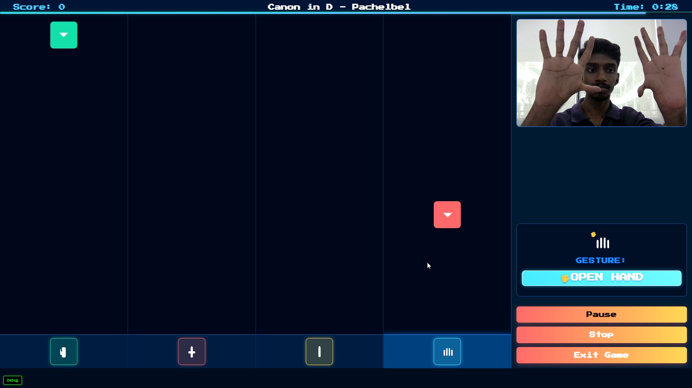

# Gesture-Based Beat Game 🎮

A rhythm-based game that uses hand gestures to play along with music. Control the game using different hand gestures captured through your webcam!

## 🎯 Game Overview

This game combines rhythm gameplay with hand gesture recognition. Players need to match their hand gestures with the falling arrows on screen, creating a unique and interactive gaming experience. The game features:

- Real-time hand gesture recognition
- Multiple difficulty levels
- Song selection from YouTube
- Score tracking and leaderboards
- Customizable game settings
- Visual feedback and combo system

## 📸 Game Screenshots

### Main Interface

*The main menu interface of the game*

### How to Play

*Tutorial screen showing game instructions*

### Song Selection

*Search and select your favorite songs*

### Game Settings

*Customize your game experience*

### Gameplay

*In-game action with gesture recognition*

## 🎮 Gestures

The game recognizes four main gestures:

### Peace Sign ✌️

*Show a peace sign to match the peace gesture*

### Index Finger ☝️

*Point your index finger up to match the index gesture*

### Fist 👊

*Make a fist to match the fist gesture*

### Open Hand 🤟

*Show your open hand to match the open hand gesture*

## 🛠️ Setup Instructions

### Prerequisites
- Python 3.9 or higher
- Webcam
- Internet connection (for YouTube song search)

### Installation

1. Clone the repository:
```bash
git clone https://github.com/yourusername/Gesture-Based-Beat-Game.git
cd Gesture-Based-Beat-Game
```

2. Create and activate a virtual environment:
```bash
py -3.9 -m venv venv
.\venv\Scripts\activate
```

3. Install required packages:
```bash
pip install -r requirements.txt
```

4. Run the game:
```bash
python main.py
```

The game will automatically open in your default web browser at `http://localhost:8000`.

## 🎵 Game Features

### Song Selection
- Search and select songs from YouTube
- Automatic BPM detection
- Difficulty scaling based on song tempo

### Game Modes
- Single Player Mode
- Tutorial Mode
- Practice Mode

### Difficulty Levels
- Easy: Super slow pace for beginners
- Medium: Balanced pace for casual players
- Hard: Fast-paced challenge for experienced players
- Expert: Intense rhythm challenge for experts

### Scoring System
- Perfect hits: 100 points
- Great hits: 75 points
- Good hits: 50 points
- Combo multiplier system
- Perfect streak bonuses

## 🎯 How to Play

1. Start the game and select a song
2. Position yourself in front of your webcam
3. Match your hand gestures with the falling arrows
4. Score points by hitting the gestures at the right time
5. Build up combos for higher scores
6. Try to achieve the highest accuracy possible

## ⚙️ Game Settings

- Adjust game speed
- Set time limit
- Customize music and effects volume
- Choose difficulty level
- Enable/disable visual effects

## 🐛 Troubleshooting

If you encounter any issues:

1. Ensure your webcam is properly connected and accessible
2. Check that all required packages are installed
3. Verify your Python version is 3.9 or higher
4. Make sure you have a stable internet connection for song search
5. Try restarting the webcam using the diagnostic tool in-game

## 📝 Requirements

See `requirements.txt` for a complete list of dependencies.

## 🤝 Contributing

Contributions are welcome! Please feel free to submit a Pull Request.

## 📄 License

This project is licensed under the MIT License - see the LICENSE file for details. 